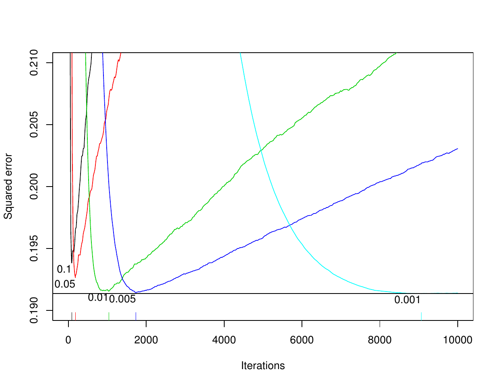
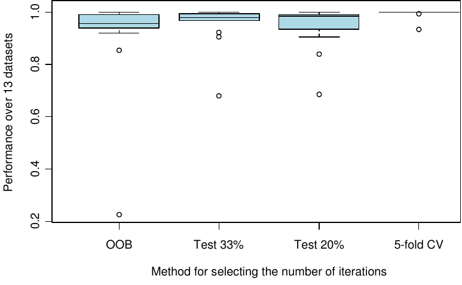

Boosting takes on various forms with different programs using different
loss functions, different base models, and different optimization
schemes. The gbm package takes the approach described in
[@Friedman:2001] and [@Friedman:2002]. Some of the terminology differs,
mostly due to an effort to cast boosting terms into more standard
statistical terminology (e.g. deviance). In addition, the gbm package
implements boosting for models commonly used in statistics but not
commonly associated with boosting. The Cox proportional hazard model,
for example, is an incredibly useful model and the boosting framework
applies quite readily with only slight modification [@Ridgeway:1999].
Also some algorithms implemented in the gbm package differ from the
standard implementation. The AdaBoost algorithm [@FreundSchapire:1997]
has a particular loss function and a particular optimization algorithm
associated with it. The gbm implementation of AdaBoost adopts AdaBoost's
exponential loss function (its bound on misclassification rate) but uses
Friedman's gradient descent algorithm rather than the original one
proposed. So the main purposes of this document is to spell out in
detail what the gbm package implements.

# Gradient boosting

This section essentially presents the derivation of boosting described
in [@Friedman:2001]. The gbm package also adopts the stochastic gradient
boosting strategy, a small but important tweak on the basic algorithm,
described in [@Friedman:2002].

## Friedman's gradient boosting machine {#sec:GradientBoostingMachine}

<figure id="fig:GradientBoost">
<div class="center">
<hr />
</div>
<p>Initialize <span
class="math inline"><em>f̂</em>(<strong>x</strong>)</span> to be a
constant, <span class="math inline">$\hat f(\mathbf{x}) = \arg
\min_{\rho} \sum_{i=1}^N \Psi(y_i,\rho)$</span>.<br />
For <span class="math inline"><em>t</em></span> in <span
class="math inline">1, …, <em>T</em></span> do</p>
<ol>
<li><p>Compute the negative gradient as the working response <span
class="math display">$$\begin{equation}
    z_i = -\frac{\partial}{\partial f(\mathbf{x}_i)}
\Psi(y_i,f(\mathbf{x}_i)) \mbox{\Huge $|$}_{f(\mathbf{x}_i)=\hat
f(\mathbf{x}_i)}
\end{equation}$$</span></p></li>
<li><p>Fit a regression model, <span
class="math inline"><em>g</em>(<strong>x</strong>)</span>, predicting
<span class="math inline"><em>z</em><sub><em>i</em></sub></span> from
the covariates <span
class="math inline"><strong>x</strong><sub><em>i</em></sub></span>.</p></li>
<li><p>Choose a gradient descent step size as <span
class="math display">$$\begin{equation}
    \rho = \arg \min_{\rho} \sum_{i=1}^N \Psi(y_i,\hat
f(\mathbf{x}_i)+\rho g(\mathbf{x}_i))
\end{equation}$$</span></p></li>
<li><p>Update the estimate of <span
class="math inline"><em>f</em>(<strong>x</strong>)</span> as <span
class="math display"><em>f̂</em>(<strong>x</strong>) ← <em>f̂</em>(<strong>x</strong>) + <em>ρ</em><em>g</em>(<strong>x</strong>)</span></p></li>
</ol>
<div class="center">
<hr />
</div>
<figcaption>Figure 1. Friedman's Gradient Boost algorithm</figcaption>
</figure>

Friedman (2001) and the companion paper Friedman (2002) extended the
work of Friedman, Hastie, and Tibshirani (2000) and laid the ground work
for a new generation of boosting algorithms. Using the connection
between boosting and optimization, this new work proposes the Gradient
Boosting Machine.

In any function estimation problem we wish to find a regression
function, $\hat f(\mathbf{x})$, that minimizes the expectation of some
loss function, $\Psi(y,f)$, as shown in
\@ref(eq:NonparametricRegression1).

$$\begin{eqnarray}
\hspace{0.5in}
\hat f(\mathbf{x}) &=& \arg \min_{f(\mathbf{x})} \mathrm{E}_{y,\mathbf{x}} \Psi(y,f(\mathbf{x})) \nonumber \\ (\#eq:NonparametricRegression1)
&=& \arg \min_{f(\mathbf{x})} \mathrm{E}_x \left[ \mathrm{E}_{y|\mathbf{x}} \Psi(y,f(\mathbf{x})) \Big| \mathbf{x} \right]
\end{eqnarray}$$

We will focus on finding estimates of $f(\mathbf{x})$ such that
$$\begin{equation}
(\#eq:NonparametricRegression2)
\hspace{0.5in}
\hat f(\mathbf{x}) = \arg \min_{f(\mathbf{x})} \mathrm{E}_{y|\mathbf{x}} \left[ \Psi(y,f(\mathbf{x}))|\mathbf{x} \right]
\end{equation}$$ Parametric regression models assume that
$f(\mathbf{x})$ is a function with a finite number of parameters,
$\beta$, and estimates them by selecting those values that minimize a
loss function (e.g. squared error loss) over a training sample of $N$
observations on $(y,\mathbf{x})$ pairs as in
\@ref(eq:Friedman1). $$\begin{equation}
(\#eq:Friedman1)
\hspace{0.5in}
\hat\beta = \arg \min_{\beta} \sum_{i=1}^N \Psi(y_i,f(\mathbf{x}_i;\beta))
\end{equation}$$ When we wish to estimate $f(\mathbf{x})$
non-parametrically the task becomes more difficult. Again we can proceed
similarly to [@FHT:2000] and modify our current estimate of
$f(\mathbf{x})$ by adding a new function $f(\mathbf{x})$ in a greedy
fashion. Letting $f_i = f(\mathbf{x}_i)$, we see that we want to
decrease the $N$ dimensional function $$\begin{eqnarray}
(\#eq:Friedman2)
\hspace{0.5in}
J(\mathbf{f}) &=& \sum_{i=1}^N \Psi(y_i,f(\mathbf{x}_i)) \nonumber \\
                          &=& \sum_{i=1}^N \Psi(y_i,F_i).
\end{eqnarray}$$ The negative gradient of $J(\mathbf{f})$ indicates the
direction of the locally greatest decrease in $J(\mathbf{f})$. Gradient
descent would then have us modify $\mathbf{f}$ as $$\begin{equation}
(\#eq:Friedman3)
\hspace{0.5in}
\hat \mathbf{f} \leftarrow \hat \mathbf{f} - \rho \nabla J(\mathbf{f})
\end{equation}$$ where $\rho$ is the size of the step along the
direction of greatest descent. Clearly, this step alone is far from our
desired goal. First, it only fits $f$ at values of $\mathbf{x}$ for
which we have observations. Second, it does not take into account that
observations with similar $\mathbf{x}$ are likely to have similar values
of $f(\mathbf{x})$. Both these problems would have disastrous effects on
generalization error. However, Friedman suggests selecting a class of
functions that use the covariate information to approximate the
gradient, usually a regression tree. This line of reasoning produces his
Gradient Boosting algorithm shown in Figure 1. At each iteration the algorithm
determines the direction, the gradient, in which it needs to improve the
fit to the data and selects a particular model from the allowable class
of functions that is in most agreement with the direction. In the case
of squared-error loss,
$\Psi(y_i,f(\mathbf{x}_i)) = \sum_{i=1}^N (y_i-f(\mathbf{x}_i))^2$, this
algorithm corresponds exactly to residual fitting.

There are various ways to extend and improve upon the basic framework
suggested in Figure 1. For example, Friedman (2001) substituted
several choices in for $\Psi$ to develop new boosting algorithms for
robust regression with least absolute deviation and Huber loss
functions. Friedman (2002) showed that a simple subsampling trick can
greatly improve predictive performance while simultaneously reduce
computation time. Section \@ref(GBMModifications) discusses some of these modifications.

# Improving boosting methods using control of the learning rate, sub-sampling, and a decomposition for interpretation {#GBMModifications}

This section explores the variations of the previous algorithms that
have the potential to improve their predictive performance and
interpretability. In particular, by controlling the optimization speed
or learning rate, introducing low-variance regression methods, and
applying ideas from robust regression we can produce non-parametric
regression procedures with many desirable properties. As a by-product
some of these modifications lead directly into implementations for
learning from massive datasets. All these methods take advantage of the
general form of boosting $$\begin{equation}
\hat f(\mathbf{x}) \leftarrow \hat f(\mathbf{x}) + \mathrm{E}(z(y,\hat f(\mathbf{x}))|\mathbf{x}).
\end{equation}$$ So far we have taken advantage of this form only by
substituting in our favorite regression procedure for
$\mathrm{E}_w(z|\mathbf{x})$. I will discuss some modifications to
estimating $\mathrm{E}_w(z|\mathbf{x})$ that have the potential to
improve our algorithm.

## Decreasing the learning rate

As several authors have phrased slightly differently, "\...boosting,
whatever flavor, seldom seems to overfit, no matter how many terms are
included in the additive expansion". This is not true as the discussion
to [@FHT:2000] points out.

In the update step of any boosting algorithm we can introduce a learning
rate to dampen the proposed move. $$\begin{equation}
(\#eq:shrinkage)
\hat f(\mathbf{x}) \leftarrow \hat f(\mathbf{x}) + \lambda \mathrm{E}(z(y,\hat f(\mathbf{x}))|\mathbf{x}).
\end{equation}$$ By multiplying the gradient step by $\lambda$ as in
Equation \@ref(eq:shrinkage) we have control on the rate at which the
boosting algorithm descends the error surface (or ascends the likelihood
surface). When $\lambda=1$ we return to performing full gradient steps.
Friedman (2001) relates the learning rate to regularization through
shrinkage.

The optimal number of iterations, $T$, and the learning rate, $\lambda$,
depend on each other. In practice I set $\lambda$ to be as small as
possible and then select $T$ by cross-validation. Performance is best
when $\lambda$ is as small as possible performance with decreasing
marginal utility for smaller and smaller $\lambda$. Slower learning
rates do not necessarily scale the number of optimal iterations. That
is, if when $\lambda=1.0$ and the optimal $T$ is 100 iterations, does
*not* necessarily imply that when $\lambda=0.1$ the optimal $T$ is 1000
iterations.

## Variance reduction using subsampling

Friedman (2002) proposed the stochastic gradient boosting algorithm that
simply samples uniformly without replacement from the dataset before
estimating the next gradient step. He found that this additional step
greatly improved performance. We estimate the regression
$\mathrm{E}(z(y,\hat f(\mathbf{x}))|\mathbf{x})$ using a random
subsample of the dataset.

## ANOVA decomposition

Certain function approximation methods are decomposable in terms of a
"functional ANOVA decomposition". That is a function is decomposable as
$$\begin{equation}
(\#eq:ANOVAdecomp)
f(\mathbf{x}) = \sum_j f_j(x_j) + \sum_{jk} f_{jk}(x_j,x_k) + \sum_{jk\ell} f_{jk\ell}(x_j,x_k,x_\ell) + \cdots.
\end{equation}$$ This applies to boosted trees. Regression stumps (one
split decision trees) depend on only one variable and fall into the
first term of Equation \@ref(eq:ANOVAdecomp). Trees with two splits fall into the second
term of Equation \@ref(eq:ANOVAdecomp) and so on. By restricting the depth of the
trees produced on each boosting iteration we can control the order of
approximation. Often additive components are sufficient to approximate a
multivariate function well, generalized additive models, the naı̈ve Bayes
classifier, and boosted stumps for example. When the approximation is
restricted to a first order we can also produce plots of $x_j$ versus
$f_j(x_j)$ to demonstrate how changes in $x_j$ might affect changes in
the response variable.

## Relative influence

Friedman (2001) also develops an extension of a variable's "relative
influence" for boosted estimates. For tree based methods the approximate
relative influence of a variable $x_j$ is $$\begin{equation}
(\#eq:RelInfluence)
\hspace{0.5in} 
\hat J_j^2 = \hspace{-0.1in}\sum_{\mathrm{splits~on~}x_j}\hspace{-0.2in}I_t^2
\end{equation}$$ where $I_t^2$ is the empirical improvement by splitting
on $x_j$ at that point. Friedman's extension to boosted models is to
average the relative influence of variable $x_j$ across all the trees
generated by the boosting algorithm.

<figure id="fig:gbm">
<div class="center">
<hr />
</div>
<p>Select</p>
<ul>
<li><p>a loss function (<code>distribution</code>)</p></li>
<li><p>the number of iterations, <span
class="math inline"><em>T</em></span> (<code>n.trees</code>)</p></li>
<li><p>the depth of each tree, <span
class="math inline"><em>K</em></span>
(<code>interaction.depth</code>)</p></li>
<li><p>the shrinkage (or learning rate) parameter, <span
class="math inline"><em>λ</em></span> (<code>shrinkage</code>)</p></li>
<li><p>the subsampling rate, <span class="math inline"><em>p</em></span>
(<code>bag.fraction</code>)</p></li>
</ul>
<p>Initialize <span
class="math inline"><em>f̂</em>(<strong>x</strong>)</span> to be a
constant, <span class="math inline">$\hat f(\mathbf{x}) = \arg
\min_{\rho} \sum_{i=1}^N \Psi(y_i,\rho)$</span><br />
For <span class="math inline"><em>t</em></span> in <span
class="math inline">1, …, <em>T</em></span> do</p>
<ol>
<li><p>Compute the negative gradient as the working response <span
class="math display">$$\begin{equation}
    z_i = -\frac{\partial}{\partial f(\mathbf{x}_i)}
\Psi(y_i,f(\mathbf{x}_i)) \mbox{\Huge $|$}_{f(\mathbf{x}_i)=\hat
f(\mathbf{x}_i)}
\end{equation}$$</span></p></li>
<li><p>Randomly select <span
class="math inline"><em>p</em> × <em>N</em></span> cases from the
dataset</p></li>
<li><p>Fit a regression tree with <span
class="math inline"><em>K</em></span> terminal nodes, <span
class="math inline"><em>g</em>(<strong>x</strong>) = E(<em>z</em>|<strong>x</strong>)</span>.
This tree is fit using only those randomly selected
observations</p></li>
<li><p>Compute the optimal terminal node predictions, <span
class="math inline"><em>ρ</em><sub>1</sub>, …, <em>ρ</em><sub><em>K</em></sub></span>,
as <span
class="math display"><em>ρ</em><sub><em>k</em></sub> = arg min<sub><em>ρ</em></sub>∑<sub><strong>x</strong><sub><em>i</em></sub> ∈ <em>S</em><sub><em>k</em></sub></sub><em>Ψ</em>(<em>y</em><sub><em>i</em></sub>, <em>f̂</em>(<strong>x</strong><sub><em>i</em></sub>) + <em>ρ</em>)</span>
where <span class="math inline"><em>S</em><sub><em>k</em></sub></span>
is the set of <span class="math inline"><strong>x</strong></span>s that
define terminal node <span class="math inline"><em>k</em></span>. Again
this step uses only the randomly selected observations.</p></li>
<li><p>Update <span
class="math inline"><em>f̂</em>(<strong>x</strong>)</span> as <span
class="math display"><em>f̂</em>(<strong>x</strong>) ← <em>f̂</em>(<strong>x</strong>) + <em>λ</em><em>ρ</em><sub><em>k</em>(<strong>x</strong>)</sub></span>
where <span class="math inline"><em>k</em>(<strong>x</strong>)</span>
indicates the index of the terminal node into which an observation with
features <span class="math inline"><strong>x</strong></span> would
fall.</p></li>
</ol>
<div class="center">
<hr />
</div>
<figcaption>Figure 2. Boosting as implemented in <code>gbm()</code></figcaption>
</figure>

# Common user options

This section discusses the options to gbm that most users will need to
change or tune.

## Loss function

The first and foremost choice is `distribution`. This should be easily
dictated by the application. For most classification problems either
`bernoulli` or `adaboost` will be appropriate, the former being
recommended. For continuous outcomes the choices are `gaussian` (for
minimizing squared error), `laplace` (for minimizing absolute error),
and quantile regression (for estimating percentiles of the conditional
distribution of the outcome). Censored survival outcomes should require
`coxph`. Count outcomes may use `poisson` although one might also
consider `gaussian` or `laplace` depending on the analytical goals.

## The relationship between shrinkage and number of iterations

The issues that most new users of gbm struggle with are the choice of
`n.trees` and `shrinkage`. It is important to know that smaller values
of `shrinkage` (almost) always give improved predictive performance.
That is, setting `shrinkage=0.001` will almost certainly result in a
model with better out-of-sample predictive performance than setting
`shrinkage=0.01`. However, there are computational costs, both storage
and CPU time, associated with setting `shrinkage` to be low. The model
with `shrinkage=0.001` will likely require ten times as many iterations
as the model with `shrinkage=0.01`, increasing storage and computation
time by a factor of 10.
Figure \@ref(fig:shrinkViters) shows the relationship between predictive
performance, the number of iterations, and the shrinkage parameter. Note
that the increase in the optimal number of iterations between two
choices for shrinkage is roughly equal to the ratio of the shrinkage
parameters. It is generally the case that for small shrinkage
parameters, 0.001 for example, there is a fairly long plateau in which
predictive performance is at its best. My rule of thumb is to set
`shrinkage` as small as possible while still being able to fit the model
in a reasonable amount of time and storage. I usually aim for 3,000 to
10,000 iterations with shrinkage rates between 0.01 and 0.001.

```{r shrinkViters, echo=FALSE, out.width="5in", fig.cap="Out-of-sample predictive performance by number of iterations and shrinkage. Smaller values of the shrinkage parameter offer improved predictive performance, but with decreasing marginal improvement.", fig.alt="Out-of-sample predictive performance by number of iterations and shrinkage."}

```

## Estimating the optimal number of iterations

gbm offers three methods for estimating the optimal number of iterations
after the gbm model has been fit, an independent test set (`test`),
out-of-bag estimation (`OOB`), and $v$-fold cross validation (`cv`). The
function `gbm.perf` computes the iteration estimate.

Like Friedman's MART software, the independent test set method uses a
single holdout test set to select the optimal number of iterations. If
`train.fraction` is set to be less than 1, then only the *first*
`train.fraction`$\times$`nrow(data)` will be used to fit the model. Note
that if the data are sorted in a systematic way (such as cases for which
$y=1$ come first), then the data should be shuffled before running gbm.
Those observations not used in the model fit can be used to get an
unbiased estimate of the optimal number of iterations. The downside of
this method is that a considerable number of observations are used to
estimate the single regularization parameter (number of iterations)
leaving a reduced dataset for estimating the entire multivariate model
structure. Use `gbm.perf(...,method="test")` to obtain an estimate of
the optimal number of iterations using the held out test set.

If `bag.fraction` is set to be greater than 0 (0.5 is recommended), gbm
computes an out-of-bag estimate of the improvement in predictive
performance. It evaluates the reduction in deviance on those
observations not used in selecting the next regression tree. The
out-of-bag estimator underestimates the reduction in deviance. As a
result, it almost always is too conservative in its selection for the
optimal number of iterations. The motivation behind this method was to
avoid having to set aside a large independent dataset, which reduces the
information available for learning the model structure. Use
`gbm.perf(...,method="OOB")` to obtain the OOB estimate.

Lastly, gbm offers $v$-fold cross validation for estimating the optimal
number of iterations. If when fitting the gbm model, `cv.folds=5` then
gbm will do 5-fold cross validation. gbm will fit five gbm models in
order to compute the cross validation error estimate and then will fit a
sixth and final gbm model with `n.trees`iterations using all of the
data. The returned model object will have a component labeled
`cv.error`. Note that `gbm.more` will do additional gbm iterations but
will not add to the `cv.error` component. Use
`gbm.perf(...,method="cv")` to obtain the cross validation estimate.

```{r oobperf, echo=FALSE, out.width="5in", fig.cap="Out-of-sample predictive performance of four methods of selecting the optimal number of iterations. The vertical axis plots performance relative the best. The boxplots indicate relative performance across thirteen real datasets from the UCI repository. See `demo(OOB-reps)`.", fig.alt="Comparison of methods for estimating the optimal number of boosting iterations."}

```

Figure \@ref(fig:oobperf) compares the three methods for estimating the optimal number of
iterations across 13 datasets. The boxplots show the methods performance
relative to the best method on that dataset. For most datasets the
method perform similarly, however, 5-fold cross validation is
consistently the best of them. OOB, using a 33% test set, and using a
20% test set all have datasets for which the perform considerably worse
than the best method. My recommendation is to use 5- or 10-fold cross
validation if you can afford the computing time. Otherwise you may
choose among the other options, knowing that OOB is conservative.

# Available distributions

This section gives some of the mathematical detail for each of the
distribution options that gbm offers. The gbm engine written in C++ has
access to a C++ class for each of these distributions. Each class
contains methods for computing the associated deviance, initial value,
the gradient, and the constants to predict in each terminal node.

In the equations shown below, for non-zero offset terms, replace
$f(\mathbf{x}_i)$ with $o_i + f(\mathbf{x}_i)$.

## Gaussian

  ------------------------- --------------------------------------------------------------------
  Deviance                  $\displaystyle \frac{1}{\sum w_i} \sum w_i(y_i-f(\mathbf{x}_i))^2$
  Initial value             $\displaystyle f(\mathbf{x})=\frac{\sum w_i(y_i-o_i)}{\sum w_i}$
  Gradient                  $z_i=y_i - f(\mathbf{x}_i)$
  Terminal node estimates   $\displaystyle \frac{\sum w_i(y_i-f(\mathbf{x}_i))}{\sum w_i}$
  ------------------------- --------------------------------------------------------------------

## AdaBoost

  ------------------------- -----------------------------------------------------------------------------------
  Deviance                  $\displaystyle \frac{1}{\sum w_i} \sum w_i\exp(-(2y_i-1)f(\mathbf{x}_i))$
  Initial value             $\displaystyle \frac{1}{2}\log\frac{\sum y_iw_ie^{-o_i}}{\sum (1-y_i)w_ie^{o_i}}$
  Gradient                  $\displaystyle z_i= -(2y_i-1)\exp(-(2y_i-1)f(\mathbf{x}_i))$
  Terminal node estimates   $\displaystyle \frac{\sum (2y_i-1)w_i\exp(-(2y_i-1)f(\mathbf{x}_i))}
                                  {\sum w_i\exp(-(2y_i-1)f(\mathbf{x}_i))}$
  ------------------------- -----------------------------------------------------------------------------------

## Bernoulli

  ------------------------- -------------------------------------------------------------------------------------------------
  Deviance                  $\displaystyle -2\frac{1}{\sum w_i} \sum w_i(y_if(\mathbf{x}_i)-\log(1+\exp(f(\mathbf{x}_i))))$
  Initial value             $\displaystyle \log\frac{\sum w_iy_i}{\sum w_i(1-y_i)}$
  Gradient                  $\displaystyle z_i=y_i-\frac{1}{1+\exp(-f(\mathbf{x}_i))}$
  Terminal node estimates   $\displaystyle \frac{\sum w_i(y_i-p_i)}{\sum w_ip_i(1-p_i)}$
                            where $\displaystyle p_i = \frac{1}{1+\exp(-f(\mathbf{x}_i))}$
  ------------------------- -------------------------------------------------------------------------------------------------

Notes:

- For non-zero offset terms, the computation of the initial value
  requires Newton-Raphson. Initialize $f_0=0$ and iterate
  $\displaystyle f_0 \leftarrow f_0 + \frac{\sum w_i(y_i-p_i)}{\sum w_ip_i(1-p_i)}$
  where $\displaystyle p_i = \frac{1}{1+\exp(-(o_i+f_0))}$.

## Laplace

  ------------------------- ----------------------------------------------------
  Deviance                  $\frac{1}{\sum w_i} \sum w_i|y_i-f(\mathbf{x}_i)|$
  Initial value             $\mbox{median}_w(y)$
  Gradient                  $z_i=\mbox{sign}(y_i-f(\mathbf{x}_i))$
  Terminal node estimates   $\mbox{median}_w(z)$
  ------------------------- ----------------------------------------------------

Notes:

- $\mbox{median}_w(y)$ denotes the weighted median, defined as the
  solution to the equation
  $\frac{\sum w_iI(y_i\leq m)}{\sum w_i}=\frac{1}{2}$

- `gbm()` currently does not implement the weighted median and issues a
  warning when the user uses weighted data with
  `distribution="laplace"`.

## Quantile regression

Contributed by Brian Kriegler (see [@Kriegler:2010]).

  ------------------------- ----------------------------------------------------------------------------------
  Deviance                  $\frac{1}{\sum w_i}
                               \left(\alpha\sum_{y_i>f(\mathbf{x}_i)} w_i(y_i-f(\mathbf{x}_i))\right. +$
                            $\left.(1-\alpha)\sum_{y_i\leq f(\mathbf{x}_i)} w_i(f(\mathbf{x}_i)-y_i)\right)$
  Initial value             $\mathrm{quantile}^{(\alpha)}_w(y)$
  Gradient                  $z_i=\alpha I(y_i>f(\mathbf{x}_i))-(1-\alpha)I(y_i\leq f(\mathbf{x}_i))$
  Terminal node estimates   $\mathrm{quantile}^{(\alpha)}_w(z)$
  ------------------------- ----------------------------------------------------------------------------------

Notes:

- $\mathrm{quantile}^{(\alpha)}_w(y)$ denotes the weighted quantile,
  defined as the solution to the equation
  $\frac{\sum w_iI(y_i\leq q)}{\sum w_i}=\alpha$

- `gbm()` currently does not implement the weighted median and issues a
  warning when the user uses weighted data with
  `distribution=list(name="quantile")`.

## Cox Proportional Hazard

  ------------------------- -----------------------------------------------------------------
  Deviance                  $-2\sum w_i(\delta_i(f(\mathbf{x}_i)-\log(R_i/w_i)))$
  Gradient                  $\displaystyle z_i=\delta_i - \sum_j \delta_j
                                        \frac{w_jI(t_i\geq t_j)e^{f(\mathbf{x}_i)}}
                                             {\sum_k w_kI(t_k\geq t_j)e^{f(\mathbf{x}_k)}}$
  Initial value             0
  Terminal node estimates   Newton-Raphson algorithm
  ------------------------- -----------------------------------------------------------------

1.  Initialize the terminal node predictions to 0,
    ${\mbox{\boldmath$\rho$\unboldmath}}=0$

2.  Let $\displaystyle
                 p_i^{(k)}=\frac{\sum_j I(k(j)=k)I(t_j\geq t_i)e^{f(\mathbf{x}_i)+\rho_k}}
                                {\sum_j I(t_j\geq t_i)e^{f(\mathbf{x}_i)+\rho_k}}$

3.  Let $g_k=\sum w_i\delta_i\left(I(k(i)=k)-p_i^{(k)}\right)$

4.  Let $\mathbf{H}$ be a $k\times k$ matrix with diagonal elements

    1.  Set diagonal elements
        $H_{mm}=\sum w_i\delta_i p_i^{(m)}\left(1-p_i^{(m)}\right)$

    2.  Set off diagonal elements
        $H_{mn}=-\sum w_i\delta_i p_i^{(m)}p_i^{(n)}$

5.  Newton-Raphson update
    ${\mbox{\boldmath$\rho$\unboldmath}} \leftarrow {\mbox{\boldmath$\rho$\unboldmath}} - \mathbf{H}^{-1}\mathbf{g}$

6.  Return to step 2 until convergence

Notes:

- $t_i$ is the survival time and $\delta_i$ is the death indicator.

- $R_i$ denotes the hazard for the risk set,
  $R_i=\sum_{j=1}^N w_jI(t_j\geq t_i)e^{f(\mathbf{x}_i)}$

- $k(i)$ indexes the terminal node of observation $i$

- For speed, `gbm()` does only one step of the Newton-Raphson algorithm
  rather than iterating to convergence. No appreciable loss of accuracy
  since the next boosting iteration will simply correct for the prior
  iterations inadequacy.

- `gbm()` initially sorts the data by survival time. Doing this reduces
  the computation of the risk set from $O(n^2)$ to $O(n)$ at the cost of
  a single up front sort on survival time. After the model is fit, the
  data are then put back in their original order.

## Poisson

  ------------------------- -------------------------------------------------------------------------------------
  Deviance                  -2$\frac{1}{\sum w_i} \sum w_i(y_if(\mathbf{x}_i)-\exp(f(\mathbf{x}_i)))$
  Initial value             $\displaystyle f(\mathbf{x})= \log\left(\frac{\sum w_iy_i}{\sum w_ie^{o_i}}\right)$
  Gradient                  $z_i=y_i - \exp(f(\mathbf{x}_i))$
  Terminal node estimates   $\displaystyle \log\frac{\sum w_iy_i}{\sum w_i\exp(f(\mathbf{x}_i))}$
  ------------------------- -------------------------------------------------------------------------------------

The Poisson class includes special safeguards so that the most extreme
predicted values are $e^{-19}$ and $e^{+19}$. This behavior is
consistent with `glm()`.

## Pairwise

This distribution implements ranking measures following the *LambdaMart*
algorithm [@Burges:2010]. Instances belong to *groups*; all pairs of
items with different labels, belonging to the same group, are used for
training. In *Information Retrieval* applications, groups correspond to
user queries, and items to (feature vectors of) documents in the
associated match set to be ranked.

For consistency with typical usage, our goal is to *maximize* one of the
*utility* functions listed below. Consider a group with instances
$x_1, \dots, x_n$, ordered such that $f(x_1) \geq f(x_2)
\geq \dots f(x_n)$; i.e., the *rank* of $x_i$ is $i$, where smaller
ranks are preferable. Let $P$ be the set of all ordered pairs such that
$y_i > y_j$.

1.  Fraction of concordant (i.e, correctly ordered) pairs. For the
    special case of binary labels, this is equivalent to the Area under
    the ROC Curve. $$\left\{ \begin{array}{l l}\frac{\|\{(i,j)\in P |
          f(x_i)>f(x_j)\}\|}{\|P\|}
        & P \neq \emptyset\\
        0 & \mbox{otherwise.}
        \end{array}\right.$$

2.  Mean reciprocal rank of the highest-ranked positive instance (it is
    assumed $y_i\in\{0,1\}$):
    $$\left\{ \begin{array}{l l}\frac{1}{\min\{1 \leq i \leq n |y_i=1\}}
        & \exists i: \, 1 \leq i \leq n, y_i=1\\
        0 & \mbox{otherwise.}\end{array}\right.$$

3.  Mean average precision, a generalization of MRR to multiple positive
    instances:
    $$\left\{ \begin{array}{l l} \frac{\sum_{1\leq i\leq n | y_i=1} \|\{1\leq j\leq i
        |y_j=1\}\|\,/\,i}{\|\{1\leq i\leq n | y_i=1\}\|}  & \exists i: \,
        1 \leq i \leq n, y_i=1\\ 
        0 & \mbox{otherwise.}\end{array}\right.$$

4.  Normalized discounted cumulative gain:
    $$\frac{\sum_{1\leq i\leq n} \log_2(i+1) \, y_i}{\sum_{1\leq i\leq n}
      \log_2(i+1) \, y'_i},$$ where $y'_1, \dots, y'_n$ is a reordering
    of $y_1,
      \dots,y_n$ with $y'_1 \geq y'_2 \geq \dots \geq y'_n$.

The generalization to multiple (possibly weighted) groups is
straightforward. Sometimes a cut-off rank $k$ is given for *MRR* and
*nDCG*, in which case we replace the outer index $n$ by $\min(n,k)$.

The initial value for $f(x_i)$ is always zero. We derive the gradient of
a cost function whose gradient locally approximates the gradient of the
IR measure for a fixed ranking:

$$\begin{eqnarray*}
\Phi & = & \sum_{(i,j) \in P} \Phi_{ij}\\
 & = & \sum_{(i,j) \in P} |\Delta Z_{ij}| \log \left( 1 + e^{-(f(x_i) -
    f(x_j))}\right),
\end{eqnarray*}$$ where $|\Delta Z_{ij}|$ is the absolute utility
difference when swapping the ranks of $i$ and $j$, while leaving all
other instances the same. Define $$\begin{eqnarray*}
  \lambda_{ij} & = & \frac{\partial\Phi_{ij}}{\partial f(x_i)}\\
  & = & - |\Delta Z_{ij}| \frac{1}{1 + e^{f(x_i) - f(x_j)}}\\
&   = & - |\Delta Z_{ij}| \, \rho_{ij},
\end{eqnarray*}$$ with
$$\rho_{ij} = - \frac{\lambda_{ij }}{|\Delta Z_{ij}|} = \frac{1}{1 + e^{f(x_i) - f(x_j)}}$$

For the gradient of $\Phi$ with respect to $f(x_i)$, define
$$\begin{eqnarray*}
\lambda_i & = & \frac{\partial \Phi}{\partial f(x_i)}\\
& = &  \sum_{j|(i,j) \in P} \lambda_{ij} - \sum_{j|(j,i) \in P} \lambda_{ji}\\
& = &   - \sum_{j|(i,j) \in P} |\Delta Z_{ij}| \, \rho_{ij}\\
&  & \mbox{}  + \sum_{j|(j,i) \in P} |\Delta Z_{ji}| \, \rho_{ji}.
\end{eqnarray*}$$

The second derivative is $$\begin{eqnarray*}
   \gamma_i &  \stackrel{def}{=} &  \frac{\partial^2\Phi}{\partial f(x_i)^2}\\
    & = &  \sum_{j|(i,j) \in P} |\Delta Z_{ij}| \, \rho_{ij} \, (1-\rho_{ij})\\
&  &  \mbox{} + \sum_{j|(j,i) \in P} |\Delta Z_{ji}| \, \rho_{ji} \, (1-\rho_{ji}).
\end{eqnarray*}$$

Now consider again all groups with associated weights. For a given
terminal node, let $i$ range over all contained instances. Then its
estimate is $$-\frac{\sum_i v_i\lambda_{i}}{\sum_i v_i \gamma_i},$$
where $v_i=w(\mbox{\em group}(i))/\|\{(j,k)\in\mbox{\em group}(i)\}\|.$

In each iteration, instances are reranked according to the preliminary
scores $f(x_i)$ to determine the $|\Delta Z_{ij}|$. Note that in order
to avoid ranking bias, we break ties by adding a small amount of random
noise.
